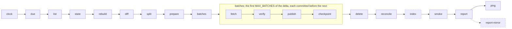

<p align="center">
  <a href="https://github.com/katoptra">
    <picture>
      <source media="(prefers-color-scheme: dark)" srcset="https://katoptra.org/brand/katoptra-mark-dark-224.png">
      
    </picture>
  </a>
</p>

<h1 align="center">tlnet</h1>

<p align="center">A daily mirror of the tlnet subtree of CTAN, the directory that tlmgr installs from.</p>

<p align="center">
  <a href="https://github.com/katoptra/tlnet/actions/workflows/sync.yml"></a>
  <a href="LICENSE"></a>
  <a href="https://github.com/katoptra/tlnet/actions/workflows/sync.yml"></a>
</p>

A daily mirror of `CTAN/systems/texlive/tlnet` on Cloudflare R2, at
`https://tlnet.katoptra.org/systems/texlive/tlnet/`. `tlmgr` installs and updates TeX Live
from this directory. The mirror has the full subtree: all the platforms, the documentation
and the sources. This is approximately 17,000 files and 6.8 GB. From the other parts of
CTAN, the mirror has only the `timestamp` file at the root. Each day, a run makes a listing
of the subtree on the master of CTAN, verifies the TeX Live signatures, and copies only the
changes.

## How to use

TeX Live and TinyTeX use `tlmgr`. To use this mirror, give these two commands:

```sh
tlmgr option repository https://tlnet.katoptra.org/systems/texlive/tlnet/
tlmgr update --self --all
```

For a new installation, give the same URL to the installer:

```sh
install-tl -repository https://tlnet.katoptra.org/systems/texlive/tlnet/
```

The paths are the same as the paths on CTAN. Thus, this host can replace the host of a CTAN
mirror URL. The mirror copies the TeX Live release that upstream has. When upstream moves to
the next release, the mirror also moves to it. The landing page at
`https://tlnet.katoptra.org/` gives the same instructions, with the date of the last run.

To set `tlmgr` back to the mirror rotation of CTAN, use `tlmgr option repository ctan`.

Is it fresh? Each hour, the master of CTAN writes its clock to `timestamp`, at the root of
CTAN. Each run copies this file to the root of the mirror. Thus, the file shows the clock of
the master at the last run (year-month-day-hour-minute, UTC):

```sh
curl -s https://tlnet.katoptra.org/timestamp
```

The `last-modified` header of `texlive.tlpdb.sha512` shows when the mirror got the last
change to the package database of TeX Live:

```sh
curl -sI https://tlnet.katoptra.org/systems/texlive/tlnet/tlpkg/texlive.tlpdb.sha512
```

## How it works

Each day, a GitHub Actions job runs this pipeline in the toolbox image from
[katoptra/lib](https://github.com/katoptra/lib). Each solid box is a verb of the toolbox or of
the rsync engine in lib. The dashed boxes are the verbs of this mirror.



[`Taskfile.yml`](Taskfile.yml) has these items of this mirror:

- **Its identity**, in the root vars:
  - `SOURCE`, the master of CTAN
  - `HOST` and `BUCKET`
  - `TL`, the signed subtree, and `TL_KEY`, the fingerprint of its key
  - `CEILING_GB`, 10 GB. If upstream is more than this, `split` stops the run.
  - `LIST_FLOOR`. If a listing has less lines than this, the listing is too short. Then the
    run stops before it deletes a key.
- **The filter.** `SOURCE` is the root of CTAN, and `FILTER` keeps only the subtree in the
  listing. Thus, each key keeps its `systems/texlive/tlnet/` prefix, and this host can
  replace the host of a CTAN mirror URL. The filter also removes the revision-stamped copies
  of the containers from the listing. `tlmgr` downloads `foo.tar.xz`, and upstream keeps
  `foo.r123.tar.xz` with a symlink to it. Two copies make the tree two times larger.
- **Freshness.** The filter also includes `timestamp` from the root of CTAN, and `FRESH_KEY`
  is `timestamp`. The master of CTAN writes its clock to this file each hour, also when the
  subtree has no changes. At the end of each run, `fresh` stops the run with an error if
  this clock is more than 24 hours before the run.
- **The canary.** `CANARY` is `systems/texlive/tlnet/tlpkg/texlive.tlpdb.sha512`. Browser
  Integrity Check sends a 403 to Perl clients. At the end of each run, `smoke` reads the
  canary as a Perl client. Thus, the run stops with an error if the domain does not serve
  this file to a Perl client.
- **The landing page.** At each run, `index` writes `site/index.html` with the date of the run
  to `.run/index.html`. Then it uploads that file to the root of the bucket. With
  `OWN: index.html`, the daily reconcile does not delete the page as a key that upstream does
  not have.
- **Its row of the run summary**, with the date of the landing page.

The engine verbs `prepare` and `verify` do the signature checks. With `TL` and `TL_KEY` set,
they verify the signatures and checksums of TeX Live before the run publishes a file.
[lib, The rsync engine](https://github.com/katoptra/lib#the-rsync-engine) tells how these
checks operate. It also tells how the list diff, the state, the canary, the freshness check
and the daily reconcile operate.

## Want your own?

### 1. Fork it

1. Fork [katoptra/tlnet](https://github.com/katoptra/tlnet).
2. In `Taskfile.yml`, change two lines: `HOST` and `BUCKET`.
3. Write your text in `site/index.html`.

Do not change `SOURCE`. A secondary mirror can get a change one day after the master.

### 2. Storage

The bucket is the mirror. It contains:

- The subtree, in `systems/texlive/tlnet/`
- The landing page and the `timestamp` of CTAN, at the root
- The listing of the last run, in `.state/`.

At 6.8 GB, the cost of the storage is approximately $0.10 a month. R2 charges $0.015 for
each GB-month. If upstream is more than 10 GB, the pipeline stops the run.

| Item | Function |
|---|---|
| An R2 bucket, or a different S3-compatible bucket | It contains the objects and their state |
| An API token with Object Read & Write, for that bucket only | It supplies the three `AWS_*` values in step 3 |
| A custom domain on the bucket, which is `HOST` | `tlmgr` and the read-back checks download from this domain |

In the rsync image of lib, the AWS CLI sends each file that is smaller than 4 GiB as one
PutObject. The largest tlnet file is approximately 145 MB.
[lib, Storage](https://github.com/katoptra/lib#storage) tells how the engine uses a bucket.
The state is only a cache of the bucket.

### 3. Secrets

Put four values in one item of your vault. Give the item the name `tlnet`.

| Section | Field | Value | Name in the run |
|---|---|---|---|
| `r2` | `access_key_id` | The token from step 2 | `AWS_ACCESS_KEY_ID` |
| `r2` | `secret_access_key` | The secret of the token | `AWS_SECRET_ACCESS_KEY` |
| `r2` | `endpoint` | `https://<account-id>.r2.cloudflarestorage.com` | `AWS_ENDPOINT_URL` |
| `healthcheck` | `url` | Optional. A healthchecks.io ping URL | `HEALTHCHECK_URL` |

1. Put the UUID of your vault in the four lines of [`op.env`](op.env).
2. Make a service account that can read that vault.
3. Store the token of the service account as the secret `OP_SERVICE_ACCOUNT_TOKEN`, on the
   organization or on the repository.

No other configuration is necessary. [lib, Secrets](https://github.com/katoptra/lib#secrets)
tells how to find the UUID of a vault, and the cause for a UUID and not a name. It also tells
how to use repository secrets as an alternative to a vault.

### 4. The zone

The zone has three Cloudflare rules. Each rule is only for the hostname of the mirror. Set the
rules one time. The pipeline does not set them, and it does not change them.

| Rule | Function |
|---|---|
| Configuration Rule | Sets Email Obfuscation, Rocket Loader, Automatic HTTPS Rewrites and Browser Integrity Check to off. The first three change HTML while Cloudflare sends it. The fourth sends a 403 to Perl and Python clients. If Browser Integrity Check is on again, the canary stops the run with an error. |
| Cache Rule | Bypass. Without it, the edge keeps `.gz` and `.exe` responses, with their headers, for hours. TeX Live can make a new installer each day. Thus, the edge can serve a previous installer, and the `.sha512` of the new installer. |
| Transform Rule | Changes the path `/` to `/index.html`. Without it, the root gives a 404, but the mirror operates correctly. `tlmgr` does not download the root. |

### 5. Do the checks, run it, schedule it

Do these steps on a laptop with go-task, the 1Password CLI, and Docker or Apple `container`:

1. Do the two checks:

   ```sh
   task check                # render every command of the pipeline inside the image; diff against render.txt
   task run -- task list     # list the subtree through FILTER, no credentials; read .run/upstream.txt
   ```

2. Pause the healthcheck before the first run.
3. In Actions, open the sync workflow.
4. Select Run workflow.

The first run finds an empty bucket. It uses the full subtree as the delta, and it fills the
bucket. If the run does not do all the batches, it starts the next run. After the bucket is
full, each run copies the delta of its day.

No file in this repository starts a run on a schedule. Do one of these steps:

- Add a `schedule:` trigger to `.github/workflows/sync.yml`, with a time that you select.
- Dispatch the workflow from an external scheduler. This mirror uses this method.

A run also does a reconcile of the bucket with the state if the last reconcile was 24 h or
more before the run. The time of day of the run has no effect.

## Operating it

`task` with no arguments prints the menu. Give the flags of a run after `--`. The `vars`
input of the workflow accepts the same flags:

```sh
task sync                                   # one run, the same thing Actions runs
task sync -- MAX_BATCHES=8                  # more of a backlog in one run
task sync -- RECONCILE=true                 # rebuild the state from the bucket and sweep orphans in this run
gh workflow run sync.yml                    # one run in Actions
gh workflow run sync.yml -f vars='RECONCILE=true'
```

Each run adds one table to its job page. The table shows:

- The start time of the run, and the number of minutes that it operated
- The delta, and the files that the run uploaded
- The state
- The storage, compared with the 10 GB ceiling
- The signature check
- The clock of CTAN, and the time since it changed
- The date on the landing page.

The only alert is a run that stops with an error. healthchecks.io sends an email if it gets
no ping for one day. Thus, it also finds a scheduler that stops.

[lib, When a run fails](https://github.com/katoptra/lib#when-a-run-fails) gives the procedure
for each verb of the engine that can stop a run. This mirror adds these data:

- **`prepare` or `verify` stopped the run.** A signature or a checksum was not correct. The run
  uploaded no file from that batch, and the mirror keeps the previous good copy. If TeX Live
  changes its key, get the new fingerprint for `TL_KEY` only from
  https://www.tug.org/texlive/verify.html.
- **`split` stopped the run.** Upstream is more than 10 GB. The mirror does not get the
  changes until you increase `CEILING_GB`. A larger ceiling also increases the cost.
- **The listing was too short.** Start the run again. If the problem continues, examine the
  master of CTAN.
- **The canary stopped the run.** The domain did not serve the canary to a Perl client, or
  it served bytes that are different from the bytes in the bucket. Examine the Configuration
  Rule of the zone (step 4). The bucket has no error.
- **`fresh` stopped the run.** The `timestamp` of CTAN did not change for more than
  24 hours. Examine the master of CTAN.
- **The state is not correct.** `task sync -- RECONCILE=true` makes the state again from a
  listing of the bucket. The bucket is the mirror. If the state is missing, the cost is one
  listing.
- **The run did not start.** No file in this repository starts a run. Examine the scheduler
  ([katoptra/dispatch](https://github.com/katoptra/dispatch#when-something-goes-wrong)).
  Then use `gh workflow list --all` to find if a person disabled the workflow. Until the
  scheduler operates again, start runs with `gh workflow run sync.yml`.

## Reference

The subtree does not change for some weeks before each TeX Live release. Thus, some weeks with
no change are not an error in the mirror. `timestamp` shows the clock of CTAN at the last run.
When upstream moves to the next release, the mirror moves with it.

TeX Live signs the SHA-512 checksums of these files with GPG:

- `texlive.tlpdb` (`tlpkg/texlive.tlpdb.sha512`)
- The installers at the root of the subtree (`install-tl*.sha512`)
- The updaters at the root of the subtree (`update-tlmgr-latest.*.sha512`).

The expiry date of the signing subkey is 2027-07-13. Each year, upstream extends the period
of the subkey. The mirror rejects a signature from an expired or revoked key, but `tlmgr`
accepts it.

The signed tlpdb has the checksum of each package container. TeX Live signs no other file in
the subtree:

- `install-tl` and `install-tl-windows.bat`
- `README.md` and `texlive.tlpdb.md5`
- The helper trees in `tlpkg/`: `TeXLive/`, `installer/`, `tlperl/`, `tltcl/` and
  `translations/`.

The mirror copies these files with no signature check. No TeX Live tool downloads them from a
repository URL. They are for installations that operate from a local copy of the tree.

Pull requests are welcome.

MIT licensed. Built by [Josh Vaughen](https://ijosh.com).
