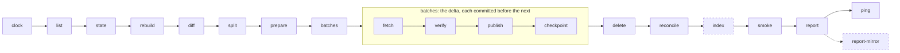

# tlnet

[](https://github.com/katoptra/tlnet/actions/workflows/sync.yml)
[](LICENSE)
[](https://github.com/katoptra/tlnet/actions/workflows/sync.yml)

A daily mirror of `CTAN/systems/texlive/tlnet` on Cloudflare R2, served at
`https://tlnet.katoptra.org/systems/texlive/tlnet/`. This is the directory `tlmgr` installs
and updates from, and it is the only part of CTAN here, complete with every platform, docs
and sources: about 17,000 files and 6.8 GB, inside R2's free tier. Each day lists the
subtree on CTAN's master, verifies TeX Live's signatures, and moves only what changed.

## How to use

TeX Live and TinyTeX both use `tlmgr`:

```sh
tlmgr option repository https://tlnet.katoptra.org/systems/texlive/tlnet/
tlmgr update --self --all
```

For a fresh install, give the installer the same URL:

```sh
install-tl -repository https://tlnet.katoptra.org/systems/texlive/tlnet/
```

The path mirrors CTAN's own layout, so the host works anywhere a CTAN mirror URL does. It
tracks the current TeX Live release and moves to the next one when upstream does. The
landing page at `https://tlnet.katoptra.org/` says the same, dated.

To go back to CTAN's mirror rotation: `tlmgr option repository ctan`.

Is it fresh? `last-modified` on the signed database:

```sh
curl -sI https://tlnet.katoptra.org/systems/texlive/tlnet/tlpkg/texlive.tlpdb.sha512
```

## How it works

Once a day a GitHub Actions job runs this pipeline inside the toolbox image from
[katoptra/lib](https://github.com/katoptra/lib). Every solid box is a verb of lib's rsync
engine; the dashed ones are this mirror's own.



What this mirror owns, in [`Taskfile.yml`](Taskfile.yml):

- **Its identity**, in root vars: `SOURCE` (CTAN's master), `HOST`, `BUCKET`, the signed
  subtree `TL` and its key fingerprint `TL_KEY`, a 10 GB `CEILING_GB` past which a run
  refuses to start, and a `LIST_FLOOR` under which a listing is taken as truncated.
- **The filter.** `SOURCE` is CTAN's root and `FILTER` narrows the listing to the subtree,
  so every key keeps its `systems/texlive/tlnet/` prefix and the host drops in anywhere
  a CTAN mirror URL does. The filter also drops the revision-stamped duplicates: `tlmgr`
  asks for `foo.tar.xz`, upstream stores `foo.r123.tar.xz` and symlinks to it, and holding
  both would double the tree.
- **The landing page.** `index` uploads `site/index.html`, dated, to the bucket root every
  run; `OWN: index.html` keeps the daily reconcile from deleting it as an orphan.
- **Its row of the run summary.**

The signature checks are the engine's: `prepare` verifies the signed `texlive.tlpdb`
against the pinned TeX Live key before anything is fetched, `verify` checks every signed
file and every package container in each batch against it, and the tlpdb lands last, after
every container it names. Everything from the list diff to the daily reconcile is
documented once in [lib's README](https://github.com/katoptra/lib#the-rsync-engine).

## Want your own?

### 1. Fork it

Fork [katoptra/tlnet](https://github.com/katoptra/tlnet). Two lines of `Taskfile.yml` are
yours to change, `HOST` and `BUCKET`, and the text of `site/index.html` is yours to
rewrite. `SOURCE` stays: a secondary mirror can lag the master by a day.

### 2. Storage

The bucket is the mirror. The subtree sits under `systems/texlive/tlnet/`, the landing
page at the root, and the listing the last run left behind under `.state/`. At 6.8 GB it
is inside R2's free tier, and the pipeline refuses to run past 10 GB upstream.

| What | Why |
|---|---|
| An R2 bucket, or any S3-compatible bucket | Objects and their state |
| An API token with Object Read & Write, scoped to that bucket | The three `AWS_*` values in step 3 |
| A custom domain on the bucket, which is `HOST` | What `tlmgr` and the read-back checks fetch from |

`aws.config` keeps every upload a single PutObject; the largest file is about 145 MB.
How the engine uses a bucket and why the state is only a cache of it:
[lib, Storage](https://github.com/katoptra/lib#storage).

### 3. Secrets

Four values, in one vault item named `tlnet`:

| Section | Field | What it is | Reaches the run as |
|---|---|---|---|
| `r2` | `access_key_id` | The token from step 2 | `AWS_ACCESS_KEY_ID` |
| `r2` | `secret_access_key` | Its secret | `AWS_SECRET_ACCESS_KEY` |
| `r2` | `endpoint` | `https://<account-id>.r2.cloudflarestorage.com` | `AWS_ENDPOINT_URL` |
| `healthcheck` | `url` | Optional: a healthchecks.io ping URL | `HEALTHCHECK_URL` |

Put your vault's UUID into the four references in [`op.env`](op.env), make a service
account that can read that vault, and store its token as the `OP_SERVICE_ACCOUNT_TOKEN`
secret, on the organization or on the repository. That is the whole requirement. Finding a
vault's UUID, why a UUID and not a name, and the repository-secrets alternative:
[lib, Secrets](https://github.com/katoptra/lib#secrets).

### 4. The zone

One Cloudflare Transform Rule, scoped to the mirror's hostname: rewrite the path `/` to
`/index.html`. Without it the root is a 404 and the mirror still works; `tlmgr` never asks
for the root.

### 5. Prove it, run it, schedule it

On a laptop with go-task, the 1Password CLI and Docker or Apple `container`:

```sh
task check                # render every command of the pipeline inside the image; diff against render.txt
task run -- task list     # list the subtree through FILTER, no credentials; read .run/upstream.txt
task plan                 # the read-only half against your bucket: list, state, diff, split; nothing uploaded
```

Then Actions, sync, Run workflow. The first run finds an empty bucket, takes the whole
subtree as the delta and fills it, queueing the next run itself if batches remain. Every
run after that moves the day's delta.

Nothing in this repository schedules a run. Add a `schedule:` trigger to
`.github/workflows/sync.yml` with a time of your own, or dispatch it from outside as this
mirror is. A run that starts in hour 03 UTC also sweeps the bucket against the state.

## Operating it

`task` alone prints the menu. A run takes its flags after the double dash, and the same
flags go in the workflow's `vars` input:

```sh
task sync                                   # one run, the same thing Actions runs
task sync -- RECONCILE=true                 # rebuild the state from the bucket and sweep orphans now
gh workflow run sync.yml -f vars='RECONCILE=true'
```

Every run appends one table to its job page: when it started and how long it took, the
delta and what landed, the state, storage against the 10 GB ceiling, the signature check,
and the date the landing page carries. A failed run is the only alert: healthchecks.io
emails when a day passes without a ping, which also catches a scheduler that stopped.

- **`prepare` or `verify` failed.** A signature or checksum did not match. Nothing was
  uploaded from that batch; the previous good copy is live. If TeX Live rotated its key,
  `TL_KEY` is checked against https://www.tug.org/texlive/verify.html and nowhere else.
- **`split` refused the tree.** Upstream passed 10 GB. The mirror stays a day stale until
  `CEILING_GB` is raised, which also raises the bill.
- **The listing was refused.** Under `LIST_FLOOR` lines is a truncated listing, never a
  deletion list. Re-run; if it persists, CTAN's master is the place to look.
- **The state looks wrong.** `task sync -- RECONCILE=true` rebuilds it from a bucket
  listing. The bucket is the mirror; losing the state costs one listing.
- **The run did not start.** Nothing here starts one; check the scheduler, then
  `gh workflow view sync.yml` for a manual disable, and dispatch by hand meanwhile.

## Reference

tlnet goes quiet for weeks before each TeX Live release and moves to the next release's
directory when upstream does; a quiet mirror is not a stale one. The signing subkey
expires yearly and upstream extends it; a signature from an expired or revoked key is
rejected, which is stricter than `tlmgr`. Nothing else in the subtree is signed: the
installers, `texlive.tlpdb.md5` and the helper trees under `tlpkg/` are copied as served,
and no TeX Live tool fetches them from a repository URL.

Pull requests are welcome.

MIT licensed. Built by [Josh Vaughen](https://ijosh.com).
